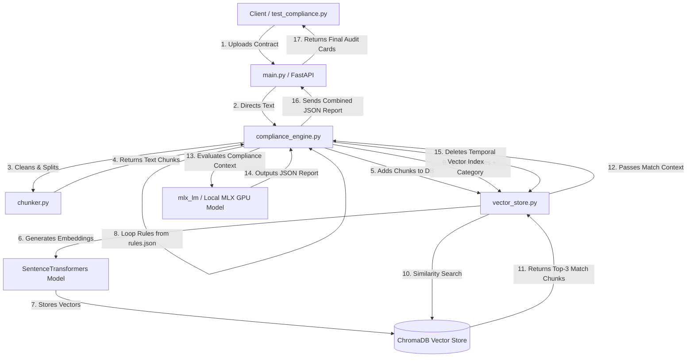

# MSA Compliance Automation: Pipeline Architecture & Deep-Dive Guide

Welcome! This architecture guide explains how the **MSA Compliance Automation** pipeline works. The system is designed to audit Master Service Agreements (MSAs) and commercial contracts against corporate compliance guidelines using Retrieval-Augmented Generation (RAG) and local Large Language Model (LLM) inference running on Apple Silicon (via Apple MLX).

---

## 1. Layman's Explanation (The "Open-Book Exam" Analogy)
If you are new to AI pipelines, think of this system as a student taking an **open-book exam**:
* **The LLM (Qwen Model)** is the student.
* **The Contract** is a massive 50-page textbook.
* **The Compliance Rules** (e.g., "Must be governed by Delaware or New York law") are the exam questions.

If the student tried to read and memorize the entire textbook all at once, they would run out of working memory (this is the *context window limit* of the LLM) and get confused.

Instead, we have an **assistant (ChromaDB + SentenceTransformers)**:
1. The assistant rips the textbook into individual paragraphs (**Chunking**).
2. The assistant indexes every paragraph based on what it means (**Embedding / Vector Storage**).
3. When an exam question is asked (e.g., "What is the governing law?"), the assistant runs to the index, finds the top 3 most relevant paragraphs (**Retrieval**), and lays them on the student's desk.
4. The student (LLM) reads *only* those 3 paragraphs and writes down the answer (**Generation**).
5. Once the exam is finished, the desk is wiped clean (**Transient Vector Deletion**).

---

## 2. System Directory Map

Here is how the backend pipeline files are organized in the workspace:

```
backend/
├── config/
│   └── rules.json              # Declarative compliance rules (the exam questions)
├── data/
│   ├── db/                     # Local ChromaDB vector database directory
│   └── processed/              # Processed test/train dataset JSONL files
├── src/
│   ├── __init__.py
│   ├── chunker.py              # Text cleaning and semantic chunking (tears up the pages)
│   ├── vector_store.py         # Embedding and ChromaDB queries (indexes the pages)
│   ├── compliance_engine.py    # Main RAG & LLM evaluation engine (the orchestrator)
│   └── main.py                 # FastAPI Web Server endpoints (the API gateway)
├── evaluate_rag_performance.py # End-to-end RAG pipeline benchmarking script
└── test_compliance.py          # Command-line testing script (dry-run & live)
```

---

## 3. Component Interaction Architecture

The backend operates as a modular pipeline where data flows from the client to the RAG components, through the vector store, and finally into the LLM context.



---

## 4. File & Function Breakdown

### A. Source Code (`backend/src/`)

#### 1. [chunker.py](file:///Users/siputroj/Desktop/react/MSA-Compliance-Automation/backend/src/chunker.py)
*   **Purpose**: Preprocesses raw text and divides it into segments (chunks). Since LLMs have context size limits and vector search works best with concise text, chunking is crucial.
*   **Key Functions**:
    *   `clean_text(text: str) -> str`: Standardizes newlines and spaces, removing duplicate empty lines while preserving logical double-newlines (which separate section paragraphs).
    *   `split_text(text: str) -> List[Dict[str, Any]]`: Recursively splits the document. It attempts to split at logical boundaries first (double-newlines for paragraphs, single newlines, then sentence periods, then spaces for words) so text segments don't get cut in the middle of a sentence. It implements a sliding window using a custom character overlap (`chunk_overlap`) to maintain context between consecutive chunks.

#### 2. [vector_store.py](file:///Users/siputroj/Desktop/react/MSA-Compliance-Automation/backend/src/vector_store.py)
*   **Purpose**: Acts as the semantic index. It converts text chunks into vector embeddings and saves them inside ChromaDB. Later, it searches for text semantically related to a rule description.
*   **Key Functions**:
    *   `__init__()`: Initializes the persistent ChromaDB client (`data/db/`) and downloads/loads the local embedding model (`all-MiniLM-L6-v2`), which converts raw text to 384-dimensional vector points.
    *   `add_contract_chunks(contract_name: str, chunks: List[Dict[str, Any]])`: Iterates through the list of chunks, generates unique IDs, inserts them into ChromaDB, and tags them with metadata (`contract_name`, `chunk_idx`, character boundaries).
    *   `search_relevant_chunks(contract_name: str, query: str, limit: int = 3)`: Performs a cosine similarity vector search within ChromaDB, filtering strictly by the metadata tag `contract_name` to retrieve the `limit` (default: 3) most relevant paragraphs for a specific compliance rule.
    *   `delete_contract(contract_name: str)`: Cleans up the database by deleting all vector records associated with a contract once its audit report is completed, ensuring storage footprint remains small.

#### 3. [compliance_engine.py](file:///Users/siputroj/Desktop/react/MSA-Compliance-Automation/backend/src/compliance_engine.py)
*   **Purpose**: The central controller orchestrating the entire RAG flow. It reads configuration rules, loads the local/fallback LLM, performs searches, prompts the LLM to write audits, and outputs the final structured report.
*   **Key Functions**:
    *   `__init__()`: Loads rules from config, registers the Chunker and Vector Store, and flags whether to execute in CPU/Dry-run simulation mode or hardware-accelerated GPU inference.
    *   `_load_rules() -> List[Dict[str, Any]]`: Reads compliance rules and criteria from `config/rules.json`.
    *   `load_model()`: Handles loading the MLX weights. If the fine-tuned custom model is missing under `backend/models`, it downloads a fallback instruct model from Hugging Face.
    *   `evaluate_rule(rule: Dict[str, Any], retrieved_chunks: List[Dict[str, Any]]) -> Dict[str, Any]`: Formats the prompt using the ChatML template, passes the rule descriptions and retrieved contract segments into the context, runs local GPU text generation, and parses the model's output into a clean JSON audit object.
    *   `_simulate_rule_evaluation(...)`: A fast heuristics-based dry-run engine that evaluates compliance using regex and keyword lookups. Essential for local pipeline testing without loading large weights.
    *   `analyze_contract_text(contract_name: str, text: str) -> Dict[str, Any]`: The main entry-point execution orchestrator. Chunks the text $\rightarrow$ uploads to database $\rightarrow$ loops through rules to query relevant segments $\rightarrow$ runs evaluations $\rightarrow$ compiles the compliance summary $\rightarrow$ triggers database deletion cleanup.

#### 4. [main.py](file:///Users/siputroj/Desktop/react/MSA-Compliance-Automation/backend/src/main.py)
*   **Purpose**: The FastAPI Web API Server that connects your backend to a React or Vue frontend.
*   **Key Endpoints**:
    *   `@app.on_event("startup")`: Initializes the global engine.
    *   `POST /api/analyze/text`: Audits raw string text submitted in JSON.
    *   `POST /api/analyze/file`: Accepts files uploaded via form data, reads the byte string, and executes the audit pipeline.
    *   `GET /api/rules`: Returns active rules configured in `rules.json`.
    *   `GET /api/health`: Provides metadata about system performance (e.g. GPU availability, dry-run state).

---

## 5. How the LLM Model is Loaded and Saved

Understanding how models are stored, loaded, and managed is crucial to prevent wasting hardware resources:

### A. The Model Caching Lifecycle (Singleton Pattern)
Loading a 7B parameter LLM takes about 30 seconds because the computer has to read gigabytes of weight parameters from disk into memory. 

To prevent this delay on every request, the pipeline uses a **lazy-loading singleton pattern**:
1. When you start the FastAPI server (`uvicorn`), it **does not** load the model immediately (saving memory during startup).
2. The very first time a user uploads a contract, the pipeline calls `load_model()` and loads the weights into your Mac's RAM/VRAM.
3. For all future contract uploads, the server reuses the **already-loaded model** directly from memory. The weights are never re-read from disk until you stop the server.

### B. Location of Model Files (Where are they saved?)
When the engine attempts to load the model:
1. **Hugging Face Cache**: The engine calls `mlx_lm.load("mlx-community/Qwen2.5-7B-Instruct-4bit")` directly.
   * `mlx-lm` checks your computer's Hugging Face cache directory (typically located at `~/.cache/huggingface/hub/`).
   * If the model files have never been downloaded, it downloads them from Hugging Face once and saves them in that cache directory.
   * On future runs, it reads the files instantly from the cache folder.

---

## 6. Detailed Sequence of Events (When Pipeline is Called)

Here is exactly what happens behind the scenes from the millisecond a user clicks "Upload Contract" to when they receive their compliance report:

### Step 1: The Request arrives
* The FastAPI web server endpoint `POST /api/analyze/file` receives the uploaded `.txt` file.
* It extracts the raw text contents and passes them to `ComplianceEngine.analyze_contract_text(contract_name, text)`.

### Step 2: The Text is Sliced into Chunks
* The engine passes the contract text to `ContractChunker.split_text()`.
* The text is cleaned and split into paragraphs/chunks (approx. 2000 characters each), with a sliding overlap of 200 characters to make sure sentences that lie on chunk boundaries don't lose context.

### Step 3: Temporary Vector database Setup
* The engine calls `ContractVectorStore.add_contract_chunks(contract_name, chunks)`.
* Every chunk is passed through the `all-MiniLM-L6-v2` model, which converts sentences into a 384-dimensional mathematical coordinate representing its semantic meaning (an **Embedding**).
* These chunks and coordinates are stored in **ChromaDB** under a tag matching the `contract_name`.

### Step 4: The Audit Loop (Retrieval + LLM Inference)
* The engine loads the active rules from `config/rules.json`.
* For each rule (e.g., "Governing Law"):
  1. The engine constructs a search query using the category and description: `[cuad_category] + [description]`.
  2. It queries ChromaDB to find the 3 paragraphs in the contract whose coordinates are closest (most semantically similar) to the query.
  3. It formats a ChatML prompt containing:
     * **System instruction**: "You are a legal auditor..."
     * **Context**: The 3 retrieved paragraphs.
     * **Evaluation criteria**: The specific corporate rules.
  4. It calls `mlx_lm.generate()`. The Apple Silicon GPU executes text generation, asking the model to respond *only* with a structured JSON string.
  5. The engine parses the JSON response (extracting `status`, `extracted_clause`, and `risk_explanation`).

### Step 5: Database Housekeeping
* After all rules are evaluated, a `finally` block runs `ContractVectorStore.delete_contract(contract_name)`.
* This deletes all vectors and texts matching the `contract_name` from ChromaDB. 
* *Why?* This ensures your local database folder (`data/db`) doesn't bloat over time and keeps data storage strictly transient.

### Step 6: Delivering the Report
* The engine compiles the results into a final report object containing a compliance percentage score and a list of cards for each rule.
* FastAPI returns this JSON object to the user interface, which renders the green, yellow, and red compliance cards.

---

## 7. Pipeline Benchmarking & Performance Evaluation

The RAG pipeline is evaluated end-to-end using the benchmarking script `evaluate_rag_performance.py`. This script measures how the chunking and retrieval parameters affect the accuracy of the final compliance audit.

### A. Evaluation Methodology
Instead of testing the LLM on isolated paragraphs, the benchmark tests the entire pipeline on full-length contract text files from the CUAD dataset:
1. **Full Contract Loading**: Loads a set of full contract `.txt` files from `cuad_data/CUAD_v1/full_contract_txt/`.
2. **Dynamic Chunking & Indexing**: Chunks and indexes the contract into ChromaDB on the fly using different chunk sizes and overlaps.
3. **Retrieval**: Queries the vector database for the top $k$ matching chunks for each compliance rule.
4. **LLM Generation**: Prompt the LLM with the retrieved context chunks to extract the target clause.
5. **Metric Calculation**: Compares the model's predictions with the gold-standard annotated answers in `data/CUAD_v1.json` at the document level.
6. **Cleanup**: Deletes indexed vectors from ChromaDB after evaluation.

### B. Evaluation Metrics
The script measures performance using two standard metrics:
*   **F1-Score (Word-Level)**: Evaluates the word-level token overlap between the extracted clause and the gold-standard answers.
*   **Exact Match (EM)**: Measures whether the normalized prediction matches the normalized gold-standard answer word-for-word.

> [!NOTE]
> For rules that do not map directly to categories in the CUAD dataset (such as Payment Terms), the evaluation is skipped to maintain metric integrity.

### C. Parameter Sweeping
To optimize production performance, the script runs a hyperparameter sweep over different RAG configurations:
*   **Configuration 1**: Chunk Size 1000, Overlap 100, Top K 3
*   **Configuration 2**: Chunk Size 2000, Overlap 200, Top K 3
*   **Configuration 3**: Chunk Size 2000, Overlap 200, Top K 5

### D. Running the Benchmark
Run the benchmark script using the Python virtual environment:
```bash
# Run in simulated dry-run mode (using keyword heuristics)
venv/bin/python evaluate_rag_performance.py --samples 3

# Run with actual local GPU MLX model generation
venv/bin/python evaluate_rag_performance.py --samples 3 --mlx
```
