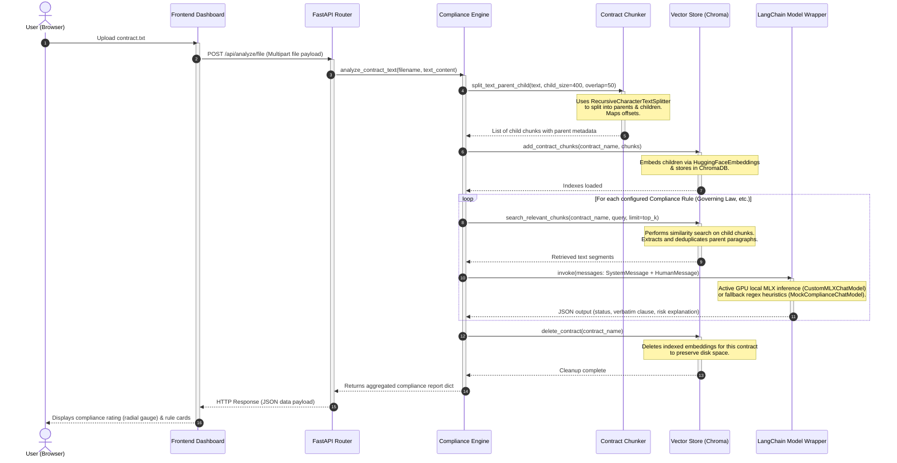
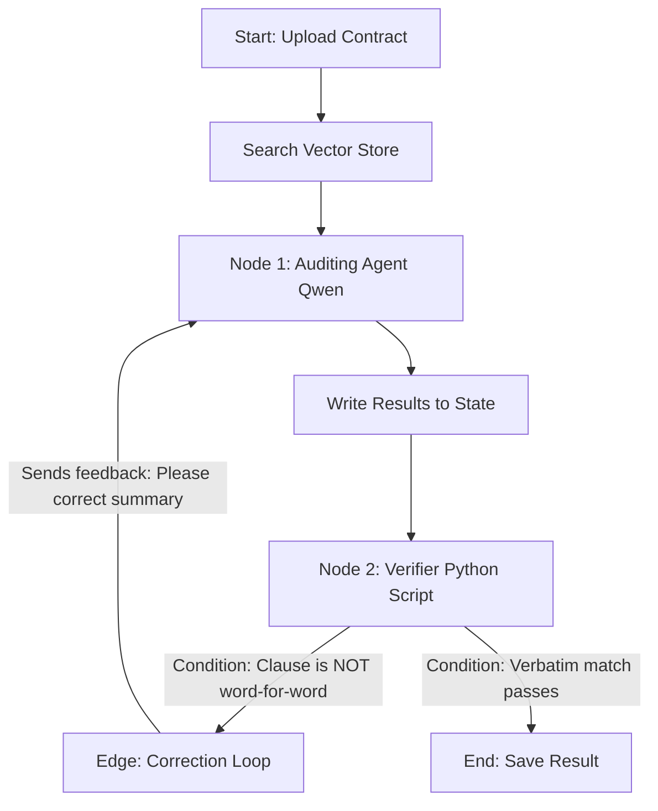

# System Architecture & Frameworks Guide

This guide breaks down the step-by-step execution flow of the **MSA Compliance Automation** system and explains the differences between **LangChain** and **LangGraph** (and how the latter would fit into this project).

---

## 1. Step-by-Step Execution Flow

Below is the execution sequence when a user uploads a Master Service Agreement (MSA) contract to receive compliance analysis.

### Sequence Diagram

### Detailed Trace of File & Function Calls

| Step | Action | Executing Function | Resides In File |
| :--- | :--- | :--- | :--- |
| **1** | Uploader triggers upload request | Frontend file handler | `frontend/src/components/ContractUpload.tsx` |
| **2** | API Controller receives request | Route `POST /api/analyze/file` | [main.py](file:///Users/siputroj/Desktop/react/MSA-Compliance-Automation/backend/src/main.py#L58-L78) |
| **3** | Core pipeline orchestration begins | `ComplianceEngine.analyze_contract_text()` | [compliance_engine.py](file:///Users/siputroj/Desktop/react/MSA-Compliance-Automation/backend/src/compliance_engine.py#L351-L411) |
| **4** | Splitting text into parents and children | `ContractChunker.split_text_parent_child()` | [chunker.py](file:///Users/siputroj/Desktop/react/MSA-Compliance-Automation/backend/src/chunker.py#L78-L135) |
| **5** | Vector DB persistence & indexing | `ContractVectorStore.add_contract_chunks()` | [vector_store.py](file:///Users/siputroj/Desktop/react/MSA-Compliance-Automation/backend/src/vector_store.py#L36-L70) |
| **6** | Searching vector database for context | `ContractVectorStore.search_relevant_chunks()` | [vector_store.py](file:///Users/siputroj/Desktop/react/MSA-Compliance-Automation/backend/src/vector_store.py#L72-L109) |
| **7** | Running LangChain RAG pipeline chain | `ComplianceEngine.evaluate_rule()` | [compliance_engine.py](file:///Users/siputroj/Desktop/react/MSA-Compliance-Automation/backend/src/compliance_engine.py#L264-L349) |
| **8** | Calling local Apple Silicon MLX Model | `CustomMLXChatModel._generate()` | [compliance_engine.py](file:///Users/siputroj/Desktop/react/MSA-Compliance-Automation/backend/src/compliance_engine.py#L173-L215) |
| **9** | Deleting session index to free disk space | `ContractVectorStore.delete_contract()` | [vector_store.py](file:///Users/siputroj/Desktop/react/MSA-Compliance-Automation/backend/src/vector_store.py#L111-L122) |

---

## 2. Framework Comparison: LangChain vs. LangGraph

Here is an entry-level explanation of LangChain and LangGraph, comparing their roles using an analogy.

### The Analogy: Building a Production Assembly Line vs. A Collaborating Team

#### A. LangChain (The Linear Conveyor Belt)
*   **What it represents**: A straight-line, sequential pipeline.
*   **How it works**: You take an input (user query), format it into a template (Prompt), feed it to the model (LLM), and parse the output (JSON). The data flows in a single direction without going backward or repeating.
    *   *Sequence*: `Input -> Prompt Template -> LLM -> Output Parser -> Output`
*   **In your system**: LangChain handles this conveyor belt: feeding retrieved contract segments into the Qwen LLM and formatting the model's text response back into a structured Python dictionary.

#### B. LangGraph (The Collaborative Meeting Room)
*   **What it represents**: A multi-step network that supports **loops, conditional decisions, and states**.
*   **How it works**: Instead of a straight line, LangGraph connects different specialized nodes (LLMs, tools, or validation scripts) together. A node can make a decision and route the task back to a previous node. 
*   **Core Concepts**:
    *   **State**: A shared memory whiteboard where nodes write or read information.
    *   **Nodes**: Workers (like specialized agent prompts or python scripts) that execute a task.
    *   **Edges**: Pathways connecting the workers, which can be conditional (e.g., *"If text is invalid, go back to step 1; if valid, proceed to output"*).

---

### Where does LangGraph fit in this Compliance Auditor?

Currently, your compliance auditor is a **linear conveyor belt** (LangChain). If the local Qwen LLM makes a formatting error or hallucinates a clause, the system simply returns a warning or parsing error.

By integrating **LangGraph**, you could convert the auditor into an **Agentic Loop**:

#### Detailed Agentic Steps in LangGraph:
1.  **Drafting Agent (Qwen Node)**: Evaluates the text segment against the compliance rule and extracts a clause.
2.  **Verifier Agent (Validation Node)**: A lightweight Python script reads the drafted clause and check if it exists *exactly* in the source contract text.
3.  **Conditional Edge (The Loop)**: 
    *   *If yes*: Passes the result directly to the final report.
    *   *If no (Qwen rephrased the clause)*: Sends the task back to Qwen with feedback: *"The clause you extracted was paraphrased. Please copy it word-for-word from the context."*
4.  Qwen receives the error feedback, corrects its output, and sends it back to the verifier node. The loop continues until the validation passes, drastically increasing the Exact Match (EM) accuracy metrics.
